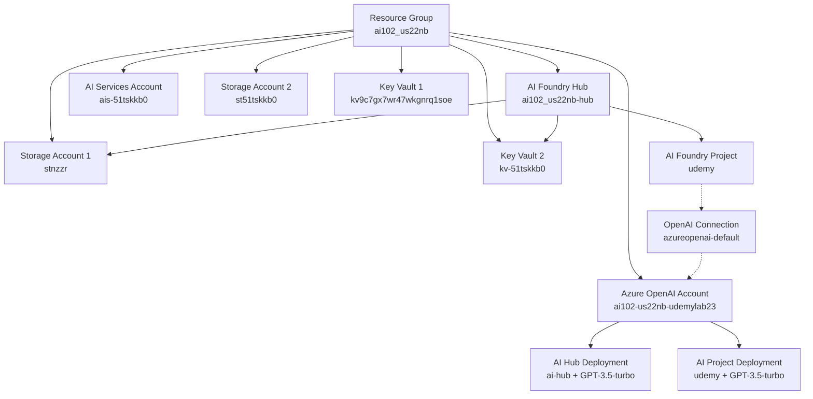
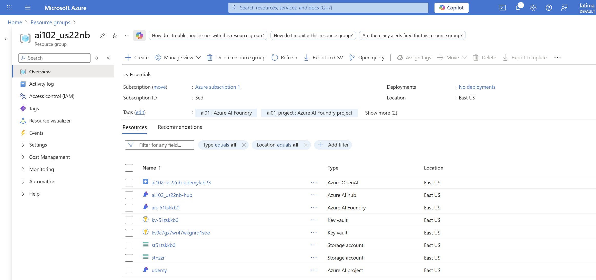

# Azure AI Foundry Terraform Module

This Terraform module creates a complete Azure AI Foundry infrastructure with the following resources:

## 🏗️ Resources Created

### Core Infrastructure
- **Resource Group**: `ai102_{unique_random_alphanumeric}` (e.g., `ai102_us22nb`)
- **AI Foundry Hub**: `{resource_group}-hub` (e.g., `ai102_us22nb-hub`)
- **AI Foundry Project**: `udemy` (default project name)
- **AI Services Account**: `ais-{random_string}` (e.g., `ais-51tskkb0`)

### Azure OpenAI Integration
- **Azure OpenAI Account**: `{resource_group}_udemylab23` (e.g., `ai102-us22nb-udemylab23`)
- **AI Hub Deployment**: `ai-hub` with GPT-3.5-turbo model
- **AI Project Deployment**: `udemy` with GPT-3.5-turbo model

### Supporting Infrastructure
- **Storage Accounts**: 2 storage accounts for data persistence
- **Key Vaults**: 2 key vaults for secure credential management
- **System-assigned identities** for all resources
- **Public network access** enabled for internet connectivity

## 🔗 Resource Architecture & Connections

### How Resources Are Connected



### Why These Resources Are Important

#### 🎯 **AI Foundry Hub & Project**
- **Purpose**: Central workspace for AI development and experimentation
- **Connection**: Hub manages projects, projects contain AI applications
- **Importance**: Provides a unified platform for building, testing, and deploying AI solutions

#### 🤖 **Azure OpenAI Integration**
- **Purpose**: Provides access to GPT models for AI applications
- **Connection**: Connected to AI Foundry project via API connections
- **Importance**: Enables developers to leverage state-of-the-art language models

#### 🗄️ **Storage Accounts**
- **Purpose**: Persistent storage for AI models, data, and artifacts
- **Connection**: AI Foundry hub uses storage for data persistence
- **Importance**: Ensures data durability and enables model versioning

#### 🔐 **Key Vaults**
- **Purpose**: Secure storage for API keys, secrets, and certificates
- **Connection**: AI Foundry hub uses Key Vault for credential management
- **Importance**: Centralized security management and compliance

#### 🆔 **System-Assigned Identities**
- **Purpose**: Secure authentication between Azure services
- **Connection**: All resources use managed identities for authentication
- **Importance**: Eliminates need for hardcoded credentials, improves security

## Features

- **Unique Naming**: Uses random string generation to ensure unique resource names
- **System Identity**: Creates system-assigned managed identity
- **Public Access**: Configures public network access for internet connectivity
- **Proper Tagging**: Applies appropriate tags for resource management
- **East US Region**: Defaults to East US region as specified

## Usage

### Basic Usage

```hcl
module "ai_foundry" {
  source = "./"
}
```

### Advanced Usage

```hcl
module "ai_foundry" {
  source = "./"
  
  location                = "eastus"
  rg_name_prefix          = "ai102"
  hub_name_suffix         = "udemylab23"
  default_project_name    = "udemy"
  allow_public_network_access = true
  openai_connection_name  = "azureopenai-default"
  
  tags = {
    Environment = "Development"
    Owner       = "AI Team"
  }
}
```

## Inputs

| Name | Description | Type | Default | Required |
|------|-------------|------|---------|:--------:|
| location | The Azure region where resources will be created | `string` | `"eastus"` | no |
| rg_name_prefix | Prefix for the resource group | `string` | `"ai102"` | no |
| hub_name_suffix | Suffix used for the AI Foundry hub name | `string` | `"udemylab23"` | no |
| default_project_name | The default AI Foundry project name to create | `string` | `"udemy"` | no |
| allow_public_network_access | If true, enables public network access on the hub | `bool` | `true` | no |
| openai_connection_name | Name for the Azure OpenAI connection in the Foundry project | `string` | `"azureopenai-default"` | no |
| tags | Tags to apply to all resources | `map(string)` | `{ai102 = "true", ai01 = "Azure AI Foundry", ai01_project = "Azure AI Foundry project", environment = "lab"}` | no |

## Outputs

| Name | Description |
|------|-------------|
| resource_group_name | The name of the created resource group |
| ai_foundry_hub_name | AI Foundry hub name |
| ai_foundry_hub_id | AI Foundry hub resource ID |
| ai_foundry_project_name | AI Foundry project name |
| ai_foundry_name | The name of the AI Foundry instance (LEGACY: actually Azure OpenAI Cognitive Account) |
| ai_foundry_endpoint | The endpoint of the AI Foundry instance (LEGACY: actually Azure OpenAI Cognitive Account) |
| ai_foundry_id | The ID of the AI Foundry instance (LEGACY: actually Azure OpenAI Cognitive Account) |
| ai_services_account_name | Azure AI Services (backing) account name |
| azure_openai_name | Azure OpenAI Cognitive Account name |
| azure_openai_id | Azure OpenAI Cognitive Account id |
| azure_openai_endpoint | Azure OpenAI Cognitive Account endpoint |
| openai_connection_name | Connection name in the Foundry project to Azure OpenAI |

## Requirements

| Name | Version |
|------|---------|
| terraform | >= 1.5.0 |
| azurerm | >= 4.40.0 |
| azapi | >= 1.14.0 |
| random | >= 3.5.0 |

## Deployment

1. **Authenticate with Azure** (required before running Terraform):
   ```bash
   az login
   ```

2. Initialize Terraform:
   ```bash
   terraform init
   ```

3. Plan the deployment:
   ```bash
   terraform plan
   ```

4. Apply the configuration:
   ```bash
   terraform apply
   ```

5. **Clean up resources** (optional - useful after training/testing):
   ```bash
   terraform destroy
   ```

## Expected Output

This module once used, gives the following outputs as shown below:

## 📸 Deployment Output



*This image shows the successfully deployed Azure AI Foundry infrastructure with all connected resources.*